# Platform Architecture Analysis, Comprehensive Site Map & Page Inventory
**Campus2Corporate | AI-Powered Career Readiness & Employability Platform**

---

## 1. Executive Project Analysis & Architectural Context

### 1.1 Overview & Mission
**Campus2Corporate (mp-online)** is a production-grade, multi-tenant career intelligence and employability platform designed to transition university students into industry-ready corporate software professionals.

The platform provides end-to-end career enablement:
- **Academics & Portfolio Building**: Multi-tier student profile managing education records, verified & self-reported skill ratings, GitHub project repositories, and industry certifications.
- **Career Intelligence**: Benchmarking student skill sets against 10 foundational tech career tracks (e.g., Backend Engineer, Frontend Specialist, Full Stack Engineer, ML Engineer, DevOps/SRE, Cloud Architect, Data Engineer, Mobile Developer, QA Automation, Cybersecurity Analyst).
- **Skill Gap Resolution & Dual-Source Course Hub**: Pinpoints missing skills, recommendations prioritized by internal platform academy courses first, followed by real-time web discovery (Free vs. Paid courses) via Tavily.
- **Resume Intelligence & ATS Scanner**: Supabase Storage-backed private document uploads (`.pdf` / `.docx`) with in-memory parsing, semantic analysis, and instant ATS scoring (0–100) with bullet-by-bullet enhancement suggestions.
- **Adaptive AI Mock Interview Studio**: Multi-turn, voice-enabled (Web Speech API / Groq Whisper) technical and behavioral interview simulators with real-time turn feedback and comprehensive post-session hiring scorecards.
- **Job & Internship Matching Engine**: Hybrid semantic matching (PostgreSQL `pgvector` embeddings + skill overlap ratios) for students, coupled with a weighted ATS candidate pipeline for recruiters.
- **Guardrailed AI Career Copilot**: A persistent conversational career advisor powered by **Google Gemini 3.5 Flash Lite** and **LangGraph**, strictly scoped to career growth, roadmaps, and profile refinement.

---

### 1.2 System Topology & Service Boundaries

```
┌────────────────────────────────────────────────────────────────────────┐
│                        Frontend Client (Vite + React)                  │
│       Port: 5173 | Public Landing | Student | Recruiter | Admin        │
└───────────────────────────────────┬────────────────────────────────────┘
                                    │ HTTPS (Bearer Supabase JWT)
                                    ▼
┌────────────────────────────────────────────────────────────────────────┐
│                     Express.js Backend (Node.js + TS)                  │
│       Port: 5000 | [backend/src/app.ts]                                │
│       - Supabase JWT Verification Auth Guard                           │
│       - Feature Modules (Zod validation, error traps, async handler)   │
│       - Private Storage Bucket Client (`resumes`)                      │
└───────────────────┬────────────────────────────────┬───────────────────┘
                    │                                │
    Internal REST   │                                │ Supabase Client SDK
    Requests        ▼                                ▼
┌──────────────────────────────────┐ ┌───────────────────────────────────┐
│     FastAPI AI Orchestrator      │ │         Supabase Backbone         │
│     Port: 8000 | [ai-service]    │ │ - Supabase Auth (Identity & JWT)  │
│     - LangChain + LangGraph      │ │ - PostgreSQL 15+ with pgvector    │
│     - Google Gemini 3.5 Flash    │ │ - Row Level Security (RLS)        │
│     - Dynamic ContextBuilder     │ │ - Storage Bucket: `resumes`       │
└──────────────────────────────────┘ └───────────────────────────────────┘
```

---

### 1.3 User Personas & Access Roles

| Role | Access Scope & Key Workflows |
|---|---|
| **Public / Guest** | Landing page, browse career tracks, browse jobs/internships previews, explore public courses, login, registration. |
| **`STUDENT`** | Manage personal portfolio, run skill gap analysis against target careers, generate AI learning roadmaps, enroll in courses, upload resumes for ATS scoring, take live AI mock interviews, apply for jobs/internships, chat with AI Copilot. |
| **`RECRUITER`** | Manage company profile, post jobs & internships with weighted skill criteria, review candidates ranked by match score, transition candidates across ATS stages (`APPLIED -> REVIEWING -> INTERVIEW_SCHEDULED -> OFFER -> SELECTED / REJECTED`). |
| **`ADMIN`** | System health telemetry, manage course catalog (add/delete internal academy modules), oversee skills taxonomy and career benchmark requirements. |

---

## 2. Platform Site Map

### 2.1 Visual Flow & Navigation Hierarchy

```mermaid
graph TD
    Root["/ (Landing Page)"]

    %% Public & Auth
    Root --> Auth["Authentication"]
    Auth --> Login["/login"]
    Auth --> Register["/register"]
    Auth --> ForgotPassword["/forgot-password"]

    Root --> ExploreCareers["/careers"]
    ExploreCareers --> CareerDetail["/careers/:id"]
    Root --> ExploreJobs["/jobs"]
    ExploreJobs --> JobDetail["/jobs/:id"]
    Root --> ExploreCourses["/courses"]

    %% Student Portal
    Root --> StudentPortal["/student (Role: STUDENT)"]
    StudentPortal --> SDashboard["/student/dashboard"]
    StudentPortal --> SProfile["/student/profile"]
    StudentPortal --> SSkills["/student/skills"]
    StudentPortal --> SCareerPlanner["/student/career-planner"]
    SCareerPlanner --> SCareerRoadmap["/student/career-planner/roadmap"]
    StudentPortal --> SCourses["/student/courses"]
    StudentPortal --> SResume["/student/resume-scanner"]
    StudentPortal --> SInterviews["/student/interviews"]
    SInterviews --> SInterviewSession["/student/interviews/session/:id"]
    SInterviews --> SInterviewReport["/student/interviews/report/:id"]
    StudentPortal --> SJobs["/student/jobs"]
    StudentPortal --> SApplications["/student/applications"]
    SApplications --> SAppTracker["/student/applications/:id"]

    %% Recruiter Portal
    Root --> RecruiterPortal["/recruiter (Role: RECRUITER)"]
    RecruiterPortal --> RDashboard["/recruiter/dashboard"]
    RecruiterPortal --> RJobs["/recruiter/jobs"]
    RJobs --> RJobCreate["/recruiter/jobs/new"]
    RJobs --> RJobEdit["/recruiter/jobs/:id/edit"]
    RJobs --> RCandidates["/recruiter/jobs/:id/candidates (ATS Kanban)"]
    RecruiterPortal --> RCompany["/recruiter/company-profile"]

    %% Admin Portal
    Root --> AdminPortal["/admin (Role: ADMIN)"]
    AdminPortal --> ADashboard["/admin/dashboard"]
    AdminPortal --> ACourses["/admin/courses"]
    AdminPortal --> ASkills["/admin/skills-taxonomy"]
    AdminPortal --> AUsers["/admin/users"]

    %% Persistent Global Overlay
    Root -.-> Copilot["Persistent AI Copilot Drawer (/api/ai/chat)"]
```



---

## 3. Comprehensive Page-by-Page Inventory

### Section A: Public & Authentication Pages (5 Pages)

#### 1. Marketing Landing Page
- **Route**: `/`
- **Access**: Public / Unauthenticated
- **Purpose**: First-touch marketing presentation of the platform.
- **Key Components**:
  - Hero banner with headline, interactive readiness score preview, and CTA buttons (`Launch Student Portal`, `Employer Login`).
  - Feature highlights: Real-time ATS Resume Scanner, Live AI Mock Interview Simulator, Gemini-powered Copilot.
  - Live metric counters (e.g., active career tracks, platform courses, mock interviews taken).
  - Testimonials & university partners showcase.
  - Sticky header navigation and site-wide footer.

#### 2. Authentication Page (Login)
- **Route**: `/login`
- **Access**: Public
- **Purpose**: Authenticates registered users via Supabase Auth.
- **Key Components**:
  - Segmented toggle or selector for **Student**, **Recruiter**, and **Admin**.
  - Email & password input fields with client validation.
  - Social OAuth buttons (GitHub, Google).
  - Forgot password modal trigger.
  - Redirect logic: On sign-in, inspects role via `GET /api/auth/me` to direct user to `/student/dashboard`, `/recruiter/dashboard`, or `/admin/dashboard`.

#### 3. User Registration Page (Signup)
- **Route**: `/register`
- **Access**: Public
- **Purpose**: Onboards new users into the platform.
- **Key Components**:
  - Persona selection cards (`I am a Student looking for career readiness` vs `I am a Recruiter looking to hire talent`).
  - Multi-step onboarding form (Personal details, institution / company name).
  - Supabase Auth registration integration.

#### 4. Career Pathways Explorer
- **Route**: `/careers` & `/careers/:id`
- **Access**: Public
- **Purpose**: Public directory showcasing in-demand software engineering tracks.
- **Key Components**:
  - Grid of careers (Backend, Frontend, Full Stack, DevOps, ML, Cloud, etc.).
  - Career detail view (`/careers/:id`): Salary range gauges (min/max), market demand badge, list of critical and optional skills with proficiency requirements.
- **APIs**: `GET /api/careers`, `GET /api/careers/:id`

#### 5. Public Opportunities Board
- **Route**: `/jobs` & `/jobs/:id`
- **Access**: Public
- **Purpose**: Searchable job and internship directory for visitors and students.
- **Key Components**:
  - Faceted search filters: Work mode (`REMOTE`, `HYBRID`, `ONSITE`), location, experience levels, employment type (`FULL_TIME`, `INTERNSHIP`).
  - Job card listing with salary estimates and required skill tags.
  - Detailed modal/drawer with job requirements and "Sign in to Apply" prompt.
- **APIs**: `GET /api/jobs`, `GET /api/internships`, `GET /api/jobs/:id`

---

### Section B: Student Portal Pages (11 Pages)
*All routes protected by `STUDENT` role and verified Supabase JWT bearer token.*

#### 6. Student Command Dashboard
- **Route**: `/student/dashboard`
- **Access**: `STUDENT`
- **Purpose**: The student's personalized daily command center.
- **Key Components**:
  - **Career Readiness Score Meter**: Circular progress indicator (0–100%) calculated from profile completeness, verified skills, and ATS resume health.
  - **Target Career Goal Widget**: Displays current target role (e.g. "Backend Engineer"), target completion date, and current readiness percentage.
  - **Quick Stat Counters**: Active job applications, upcoming mock interviews, total verified skills.
  - **High-Priority Skill Gaps**: Alert cards highlighting urgent skills needed for their target career with direct "Find Course" links.
  - **Recommended Jobs**: Top 3 matched openings based on pgvector similarity.
- **APIs**: `GET /api/auth/me`, `GET /api/students/me`, `GET /api/careers/me/goals`, `GET /api/recommendations/jobs`

#### 7. Profile & Portfolio Builder
- **Route**: `/student/profile`
- **Access**: `STUDENT`
- **Purpose**: Comprehensive student profile and portfolio management.
- **Key Components**:
  - **Profile Completeness Bar**: Real-time percentage score (Bio +15%, Education +25%, Skills +30%, Projects +20%, Socials +10%).
  - **Personal Info Tab**: Full name, contact phone, location (city, state, country), biography, LinkedIn/GitHub/Portfolio links.
  - **Education & Academics Tab**: Degree, institution, field of study, graduation year, semester-by-semester GPA entries.
  - **Projects Showcase Tab**: Title, description, live URL, GitHub repo link, featured toggle, and associated skill tags.
  - **Certifications Tab**: Name, issuing organization, issue date, credential URL.
- **APIs**: `GET /api/students/me`, `PUT /api/students/me`, `POST /api/students/me/education`, `DELETE /api/students/me/education/:id`, `POST /api/students/me/projects`, `POST /api/students/me/certifications`

#### 8. Skills Matrix & Proficiency Hub
- **Route**: `/student/skills`
- **Access**: `STUDENT`
- **Purpose**: Skill inventory, self-reporting, and verification tracking.
- **Key Components**:
  - Master skill selector with searchable combobox across 30+ platform skills.
  - Proficiency level picker (`BEGINNER`, `ELEMENTARY`, `INTERMEDIATE`, `ADVANCED`, `EXPERT`).
  - Years of experience selector.
  - Skill status badges: Verified (green checkmark badge) vs Self-Reported (amber badge).
  - Categorized skill grid (Languages, Frameworks, Cloud & DevOps, Databases, Tools).
- **APIs**: `GET /api/skills`, `GET /api/skills/me`, `POST /api/skills/me`, `PUT /api/skills/me/:id`, `DELETE /api/skills/me/:id`

#### 9. Career Planner & Skill Gap Analyzer
- **Route**: `/student/career-planner`
- **Access**: `STUDENT`
- **Purpose**: Benchmarks the student's skills against their chosen career track.
- **Key Components**:
  - Career track switcher with "Set as Primary Target" toggle.
  - **Interactive Radar Chart**: Compares student proficiency vs required role benchmark across all required skill dimensions.
  - **Skill Gap Table**: Broken down into *Critical Skills Missing*, *Important Skills Below Benchmark*, and *Bonus Skills*.
  - Direct CTA button: "Generate AI Learning Roadmap".
- **APIs**: `GET /api/careers`, `GET /api/careers/:id`, `POST /api/careers/me/goals`, `POST /api/ai/skill-gap`

#### 10. AI Career Roadmap
- **Route**: `/student/career-planner/roadmap`
- **Access**: `STUDENT`
- **Purpose**: Month-by-month personalized learning journey generated by LangGraph.
- **Key Components**:
  - Duration selector (3 months vs 6 months).
  - Vertical milestone timeline with expandable monthly goals, weekly study topics, and practical projects to build.
  - Progress checkboxes to mark milestones as completed.
  - "Export Roadmap to PDF" button.
- **APIs**: `POST /api/ai/roadmap`

#### 11. Course Hub & Skill Gap Recommendations
- **Route**: `/student/courses`
- **Access**: `STUDENT`
- **Purpose**: Intelligent course catalog combining platform academy modules and live web courses.
- **Key Components**:
  - **Skill Gap Mode**: Automatically pre-filters courses targeting the student's identified skill gaps.
  - **Dual Source Tabs**:
    - *Platform Academy*: Internal courses with duration, level, and enrollment progress bars.
    - *Free Web Courses*: Live-scraped courses (Linux Foundation, YouTube, freeCodeCamp, etc.) via Tavily search.
    - *Paid Web Courses*: Professional certifications (Coursera, Udemy, edX).
  - Student learning tracker (Mark In Progress, Update % Completion, Mark Completed).
- **APIs**: `GET /api/courses`, `POST /api/courses/recommendations/skill-gap`, `GET /api/courses/me/progress`, `PUT /api/courses/me/progress/:id`

#### 12. Resume Studio & ATS Scanner
- **Route**: `/student/resume-scanner`
- **Access**: `STUDENT`
- **Purpose**: Private resume upload, text extraction, and instant AI-driven ATS evaluation.
- **Key Components**:
  - Drag-and-drop file upload zone (accepts `.pdf`, `.docx`, max 5 MB).
  - Target career selection dropdown for role-tailored ATS scoring.
  - **ATS Score Dial**: 0–100 radial score with color status (Green 80+, Amber 60–79, Red <60).
  - **Extracted vs Missing Skills**: Tag clouds showing matched keywords vs missing job keywords.
  - **Bullet Point Critique**: Actionable checklist cards highlighting strengths and recommended phrasing enhancements.
  - Secure signed download button hitting Supabase private storage.
- **APIs**: `POST /api/resumes/upload`, `GET /api/resumes/:id/download-url`, `POST /api/resumes/:id/analyze`

#### 13. AI Mock Interview Lobby
- **Route**: `/student/interviews`
- **Access**: `STUDENT`
- **Purpose**: Configure and launch an AI-simulated interview session.
- **Key Components**:
  - Session configuration card: Target role, interview type (`TECHNICAL`, `BEHAVIORAL`, `MIXED`), question count (3 to 10).
  - Audio and microphone check utility (Web Speech API test).
  - Past interview history table with previous dates, questions answered, overall scores, and hire verdicts.
- **APIs**: `GET /api/interviews/history`, `POST /api/interviews/generate`

#### 14. Live AI Interview Simulator Room
- **Route**: `/student/interviews/session/:id`
- **Access**: `STUDENT`
- **Purpose**: Distraction-free, real-time conversational interview environment.
- **Key Components**:
  - AI Interviewer card with animated speaking pulse and Web Speech Synthesis audio playback.
  - Turn indicator (e.g. "Question 3 of 5").
  - Response mode toggle: Speech input with real-time speech-to-text transcript or Code/Text editor.
  - Turn submit button triggering dynamic evaluation and next question generation.
  - Real-time turn evaluation drawer (Turn score, clarity score, depth score, feedback).
- **APIs**: `POST /api/interviews/:id/turn`

#### 15. Interview Performance Scorecard
- **Route**: `/student/interviews/report/:id`
- **Access**: `STUDENT`
- **Purpose**: Post-interview debrief and hiring evaluation breakdown.
- **Key Components**:
  - Overall hire verdict badge (`STRONG_HIRE`, `HIRE`, `LEANING_NO`, `NO_HIRE`).
  - Score breakdown gauges: Technical Depth, Communication Clarity, Problem Solving.
  - Key strengths bullet points and prioritized areas for growth.
  - Action button: "Practice Again" or "Review Missing Skills in Course Hub".
- **APIs**: `POST /api/interviews/:id/report`

#### 16. Student Applications Tracker (ATS)
- **Route**: `/student/applications` & `/student/applications/:id`
- **Access**: `STUDENT`
- **Purpose**: Track all job and internship applications across their lifecycle.
- **Key Components**:
  - Application cards with company logo, role title, applied date, and match score.
  - **Visual Status Stepper**: Interactive progression bar:
    `APPLIED` ➔ `REVIEWING` ➔ `INTERVIEW_SCHEDULED` ➔ `OFFER` ➔ `SELECTED` (or `REJECTED` / `WITHDRAWN`).
  - Status audit history timeline showing recruiter notes and timestamp transitions.
  - Option to withdraw application (`status = WITHDRAWN`).
- **APIs**: `GET /api/applications/me`, `GET /api/applications/:id`, `PATCH /api/applications/:id/status`

---

### Section C: Recruiter Portal Pages (5 Pages)
*All routes protected by `RECRUITER` or `ADMIN` role.*

#### 17. Recruiter Metrics Dashboard
- **Route**: `/recruiter/dashboard`
- **Access**: `RECRUITER`, `ADMIN`
- **Purpose**: High-level overview of hiring pipelines.
- **Key Components**:
  - Metric stat cards: Total Active Jobs, Total Applicants, Candidates in Interview, Offers Extended.
  - Recent candidate applications feed with match score badges.
  - Quick action CTA: "Post New Position".
- **APIs**: `GET /api/jobs/recruiter/metrics`, `GET /api/jobs/recruiter/active`

#### 18. Recruiter Job Postings Manager
- **Route**: `/recruiter/jobs`
- **Access**: `RECRUITER`, `ADMIN`
- **Purpose**: Manage active and closed job and internship openings.
- **Key Components**:
  - Table of postings: Title, Type (Job vs Internship), Location, Work Mode, Total Applicants, Status (Active/Closed).
  - Actions: "View Candidates (ATS)", "Edit Posting", "Close Position".
- **APIs**: `GET /api/jobs`, `GET /api/internships`

#### 19. Job & Internship Creation Wizard
- **Route**: `/recruiter/jobs/new`
- **Access**: `RECRUITER`, `ADMIN`
- **Purpose**: Post opportunities with weighted skill tagging.
- **Key Components**:
  - Role details: Title, description, employment type, location, work mode, salary band (min/max), experience requirements (min/max years).
  - **Skill Weighting Engine**:
    - Add skill from taxonomy.
    - Set required proficiency (`BEGINNER` to `EXPERT`).
    - Set importance weight (1.0 to 3.0+).
    - Mark as strictly required (`is_required: true/false`).
  - Save as Draft or Publish button.
- **APIs**: `POST /api/jobs`, `GET /api/skills`

#### 20. ATS Candidate Pipeline & Match Kanban
- **Route**: `/recruiter/jobs/:id/candidates`
- **Access**: `RECRUITER`, `ADMIN`
- **Purpose**: Candidate evaluation and stage transition workspace.
- **Key Components**:
  - **View Switcher**: Kanban Board view vs Sortable Data Table.
  - Columns / Stages: `APPLIED`, `REVIEWING`, `INTERVIEW_SCHEDULED`, `OFFER`, `SELECTED`, `REJECTED`.
  - Candidate Cards: Name, match score gauge (80%+ green, 60–79% yellow, <60% red), verified skills count, resume quick-download.
  - **Candidate Detail Modal**:
    - Complete match breakdown: Matched skills with proficiency match ratio vs missing skills.
    - Verified badge indicators.
    - Stage transition buttons strictly governed by backend state machine:
      - In `APPLIED`: Show `[Move to Reviewing]`, `[Reject]`.
      - In `REVIEWING`: Show `[Schedule Interview]`, `[Reject]`.
      - In `INTERVIEW_SCHEDULED`: Show `[Extend Offer]`, `[Reject]`.
      - In `OFFER`: Show `[Mark as Selected]`, `[Reject]`.
- **APIs**: `GET /api/jobs/:id/candidates`, `PATCH /api/applications/:id/status`, `GET /api/resumes/:id/download-url`

#### 21. Company Profile Settings
- **Route**: `/recruiter/company-profile`
- **Access**: `RECRUITER`
- **Purpose**: Maintain corporate branding and recruitment details.
- **Key Components**:
  - Company name, website URL, industry sector, headquarters location, company overview/about text, corporate logo URL.
- **APIs**: `GET /api/companies/me`, `PUT /api/companies/me`

---

### Section D: Administrator Portal Pages (4 Pages)
*All routes protected by `ADMIN` role.*

#### 22. Admin Telemetry & Health Dashboard
- **Route**: `/admin/dashboard`
- **Access**: `ADMIN`
- **Purpose**: Platform administration and infrastructure health monitor.
- **Key Components**:
  - System status cards: Express Backend (`/health`), FastAPI AI Service, Supabase Database connectivity.
  - Aggregate metrics: Total registered students, verified recruiters, active applications, resume scans performed, mock interview sessions completed.
- **APIs**: `GET /health`, `GET /api/admin/metrics`

#### 23. Course Catalog Management
- **Route**: `/admin/courses`
- **Access**: `ADMIN`
- **Purpose**: Curate platform academy course modules.
- **Key Components**:
  - Table of existing courses with difficulty, provider, duration, and associated skill tags.
  - Modal to create a new internal academy course (Title, provider, URL, description, difficulty, duration, skill tags).
  - Delete course confirmation trigger.
- **APIs**: `GET /api/courses`, `POST /api/courses`, `DELETE /api/courses/:id`

#### 24. Skills & Career Taxonomy Editor
- **Route**: `/admin/skills-taxonomy`
- **Access**: `ADMIN`
- **Purpose**: Manage the platform's core skill dictionary and career benchmarks.
- **Key Components**:
  - Master skills list with category classification (Languages, Frameworks, Cloud, Databases).
  - Form to add new skills to the taxonomy.
  - Career benchmark weights editor: Adjust skill importance weights (`CRITICAL`, `IMPORTANT`, `NICE_TO_HAVE`) for each career track.
- **APIs**: `GET /api/skills`, `POST /api/skills`, `GET /api/careers`, `POST /api/careers`

#### 25. User & Role Management
- **Route**: `/admin/users`
- **Access**: `ADMIN`
- **Purpose**: Manage platform user accounts and permissions.
- **Key Components**:
  - Searchable list of registered accounts with email, assigned role (`STUDENT`, `RECRUITER`, `ADMIN`), and creation date.
  - Role elevation/demotion controls.
- **APIs**: `GET /api/admin/users`, `PATCH /api/admin/users/:id/role`

---

### Section E: Global Floating Overlays (1 Component)

#### 26. Persistent AI Career Copilot Drawer
- **Scope**: Global (Always accessible via floating trigger on all Student pages)
- **Purpose**: Instant, guardrailed conversational career guidance.
- **Key Components**:
  - Floating action bubble on the bottom-right corner.
  - Slide-out chat drawer with message history.
  - Domain guardrails: Answers strictly career, roadmap, resume, and skill questions (gracefully declines off-topic prompts).
  - Quick action suggestion chips ("What skills am I missing for Backend Engineer?", "Review my resume ATS score", "Generate a 3-month roadmap").
  - Rich markdown rendering with interactive course links and skill badges.
- **APIs**: `POST /api/ai/chat`

---

## 4. Frontend Layout System & Shell Architecture

To ensure code reusability, four distinct shell layouts should be implemented:

```
frontend/src/layouts/
├── PublicLayout.tsx       # Marketing header with navigation links, theme toggle, and footer
├── AuthLayout.tsx         # Clean split-screen authentication layout (branding left, form right)
├── StudentLayout.tsx      # Sidebar navigation (Dashboard, Profile, Skills, Planner, Courses, Resumes, Interviews, Apps) + Topbar + Copilot Drawer
├── RecruiterLayout.tsx    # Recruiter sidebar (Dashboard, Jobs, Candidates ATS, Company Profile) + Topbar
└── AdminLayout.tsx        # Admin sidebar (Telemetry, Courses, Taxonomy, Users) + Topbar
```

---

## 5. Declarative React Router Implementation Reference

Below is the recommended route tree configuration for `frontend/src/App.tsx`:

```tsx
import { BrowserRouter, Routes, Route, Navigate } from 'react-router-dom';
import { PublicLayout } from './layouts/PublicLayout';
import { AuthLayout } from './layouts/AuthLayout';
import { StudentLayout } from './layouts/StudentLayout';
import { RecruiterLayout } from './layouts/RecruiterLayout';
import { AdminLayout } from './layouts/AdminLayout';
import { ProtectedRoute } from './components/common/ProtectedRoute';

// Public Pages
import { LandingPage } from './pages/public/LandingPage';
import { LoginPage } from './pages/auth/LoginPage';
import { RegisterPage } from './pages/auth/RegisterPage';
import { CareersExplorerPage } from './pages/public/CareersExplorerPage';
import { CareerDetailPage } from './pages/public/CareerDetailPage';
import { JobsExplorerPage } from './pages/public/JobsExplorerPage';

// Student Pages
import { StudentDashboardPage } from './pages/student/StudentDashboardPage';
import { StudentProfilePage } from './pages/student/StudentProfilePage';
import { StudentSkillsPage } from './pages/student/StudentSkillsPage';
import { CareerPlannerPage } from './pages/student/CareerPlannerPage';
import { CareerRoadmapPage } from './pages/student/CareerRoadmapPage';
import { CourseHubPage } from './pages/student/CourseHubPage';
import { ResumeScannerPage } from './pages/student/ResumeScannerPage';
import { InterviewLobbyPage } from './pages/student/InterviewLobbyPage';
import { LiveInterviewSessionPage } from './pages/student/LiveInterviewSessionPage';
import { InterviewReportPage } from './pages/student/InterviewReportPage';
import { StudentApplicationsPage } from './pages/student/StudentApplicationsPage';

// Recruiter Pages
import { RecruiterDashboardPage } from './pages/recruiter/RecruiterDashboardPage';
import { RecruiterJobsListPage } from './pages/recruiter/RecruiterJobsListPage';
import { JobPostingWizardPage } from './pages/recruiter/JobPostingWizardPage';
import { CandidateAtsKanbanPage } from './pages/recruiter/CandidateAtsKanbanPage';
import { CompanyProfilePage } from './pages/recruiter/CompanyProfilePage';

// Admin Pages
import { AdminDashboardPage } from './pages/admin/AdminDashboardPage';
import { AdminCourseManagementPage } from './pages/admin/AdminCourseManagementPage';
import { AdminTaxonomyPage } from './pages/admin/AdminTaxonomyPage';
import { AdminUsersPage } from './pages/admin/AdminUsersPage';
import { NotFoundPage } from './pages/common/NotFoundPage';

export function App() {
  return (
    <BrowserRouter>
      <Routes>
        {/* Public & Guest Routes */}
        <Route element={<PublicLayout />}>
          <Route path="/" element={<LandingPage />} />
          <Route path="/careers" element={<CareersExplorerPage />} />
          <Route path="/careers/:id" element={<CareerDetailPage />} />
          <Route path="/jobs" element={<JobsExplorerPage />} />
        </Route>

        {/* Auth Routes */}
        <Route element={<AuthLayout />}>
          <Route path="/login" element={<LoginPage />} />
          <Route path="/register" element={<RegisterPage />} />
        </Route>

        {/* Student Portal (Role: STUDENT) */}
        <Route
          path="/student"
          element={
            <ProtectedRoute allowedRoles={['STUDENT']}>
              <StudentLayout />
            </ProtectedRoute>
          }
        >
          <Route index element={<Navigate to="/student/dashboard" replace />} />
          <Route path="dashboard" element={<StudentDashboardPage />} />
          <Route path="profile" element={<StudentProfilePage />} />
          <Route path="skills" element={<StudentSkillsPage />} />
          <Route path="career-planner" element={<CareerPlannerPage />} />
          <Route path="career-planner/roadmap" element={<CareerRoadmapPage />} />
          <Route path="courses" element={<CourseHubPage />} />
          <Route path="resume-scanner" element={<ResumeScannerPage />} />
          <Route path="interviews" element={<InterviewLobbyPage />} />
          <Route path="interviews/session/:id" element={<LiveInterviewSessionPage />} />
          <Route path="interviews/report/:id" element={<InterviewReportPage />} />
          <Route path="applications" element={<StudentApplicationsPage />} />
        </Route>

        {/* Recruiter Portal (Role: RECRUITER, ADMIN) */}
        <Route
          path="/recruiter"
          element={
            <ProtectedRoute allowedRoles={['RECRUITER', 'ADMIN']}>
              <RecruiterLayout />
            </ProtectedRoute>
          }
        >
          <Route index element={<Navigate to="/recruiter/dashboard" replace />} />
          <Route path="dashboard" element={<RecruiterDashboardPage />} />
          <Route path="jobs" element={<RecruiterJobsListPage />} />
          <Route path="jobs/new" element={<JobPostingWizardPage />} />
          <Route path="jobs/:id/candidates" element={<CandidateAtsKanbanPage />} />
          <Route path="company-profile" element={<CompanyProfilePage />} />
        </Route>

        {/* Admin Portal (Role: ADMIN) */}
        <Route
          path="/admin"
          element={
            <ProtectedRoute allowedRoles={['ADMIN']}>
              <AdminLayout />
            </ProtectedRoute>
          }
        >
          <Route index element={<Navigate to="/admin/dashboard" replace />} />
          <Route path="dashboard" element={<AdminDashboardPage />} />
          <Route path="courses" element={<AdminCourseManagementPage />} />
          <Route path="skills-taxonomy" element={<AdminTaxonomyPage />} />
          <Route path="users" element={<AdminUsersPage />} />
        </Route>

        {/* Catch-all 404 */}
        <Route path="*" element={<NotFoundPage />} />
      </Routes>
    </BrowserRouter>
  );
}
```

---

## 6. Phased Frontend Implementation Roadmap

```
Phase 1: Foundations & Authentication
  ├── Base Layouts (StudentLayout, RecruiterLayout, PublicLayout)
  ├── Auth Integration (Login, Register, Session Provider via Supabase Auth)
  └── Public Landing Page

Phase 2: Core Student Career Readiness
  ├── Student Dashboard & Readiness Score Meter
  ├── Profile & Portfolio Builder (Academics, Projects, Certifications)
  ├── Skills Matrix & Verification Manager
  └── Resume Studio & ATS Scanner (Supabase bucket upload + ATS scoring)

Phase 3: AI Intelligence Workflows
  ├── Career Benchmark & Skill Gap Analyzer (Radar chart)
  ├── AI Learning Roadmap Generator (3/6-month milestone timeline)
  ├── Course Hub (Platform courses + Tavily live web course search)
  ├── Live AI Mock Interview Simulator (Voice transcription + Turn scoring)
  └── Persistent AI Copilot Drawer (Gemini 3.5 Flash Lite)

Phase 4: Recruiter Portal & ATS Kanban
  ├── Recruiter Dashboard & Job Postings Manager
  ├── Job Posting Wizard with Weighted Skill Builder
  └── ATS Candidate Pipeline Kanban (Score rankings + Stage transitions)

Phase 5: Admin Tools & Polish
  ├── Admin Telemetry & Health Dashboard
  ├── Course Catalog & Skills Taxonomy Editor
  └── Micro-animations, responsive layout refinement, and dark mode theme
```
